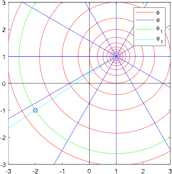
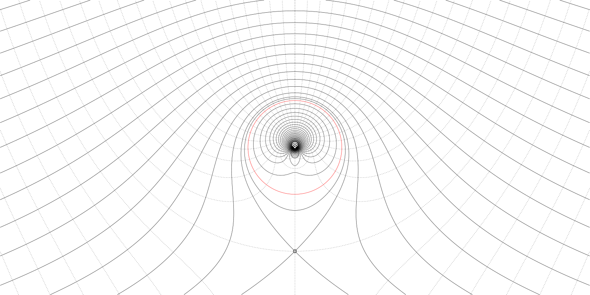
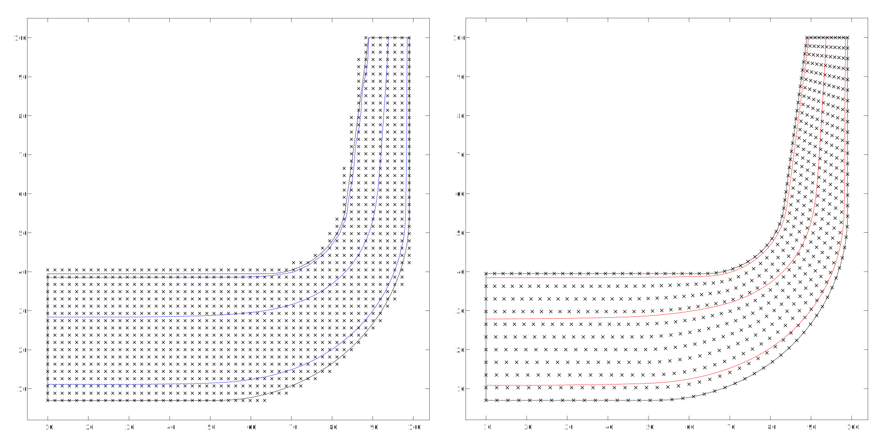
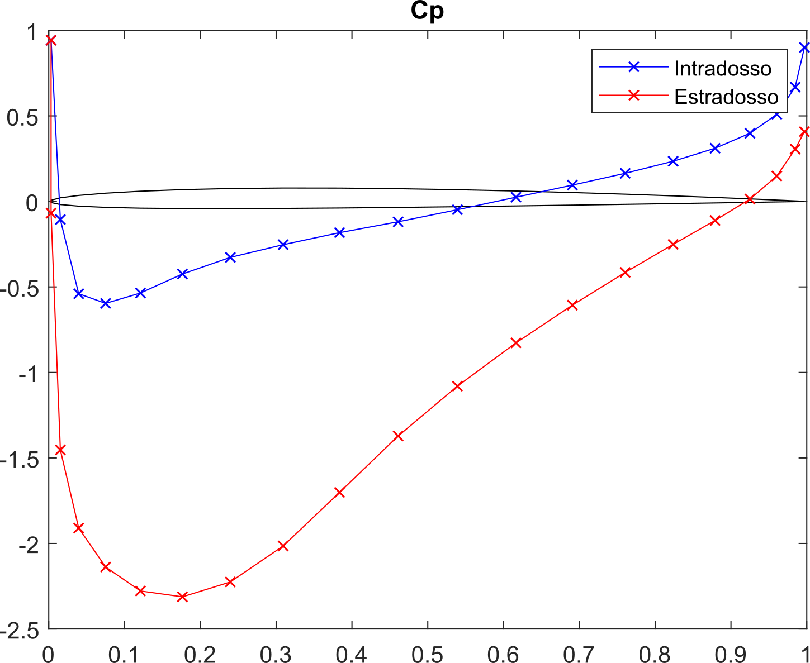
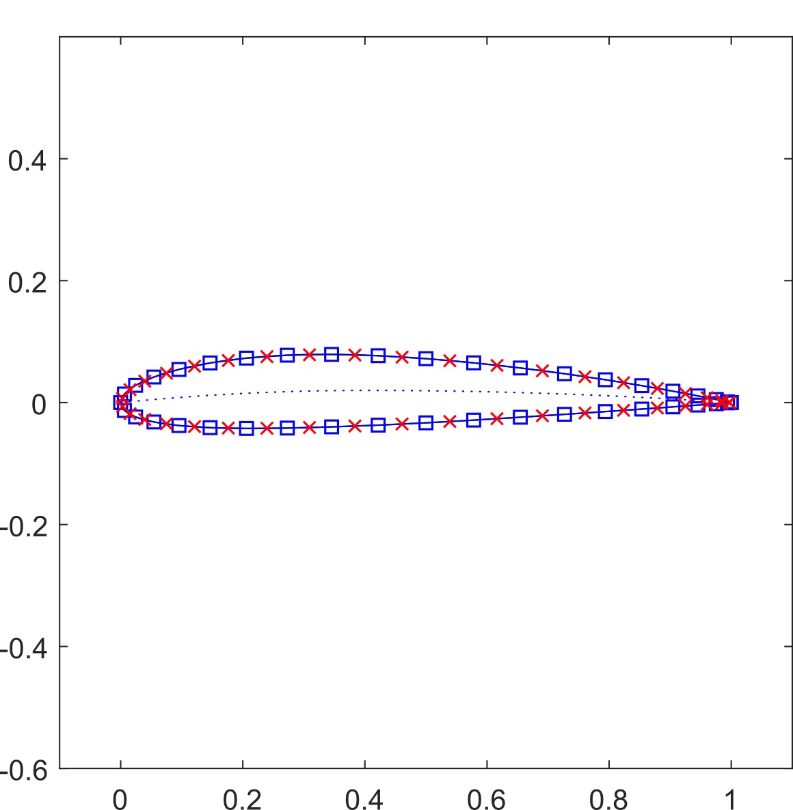
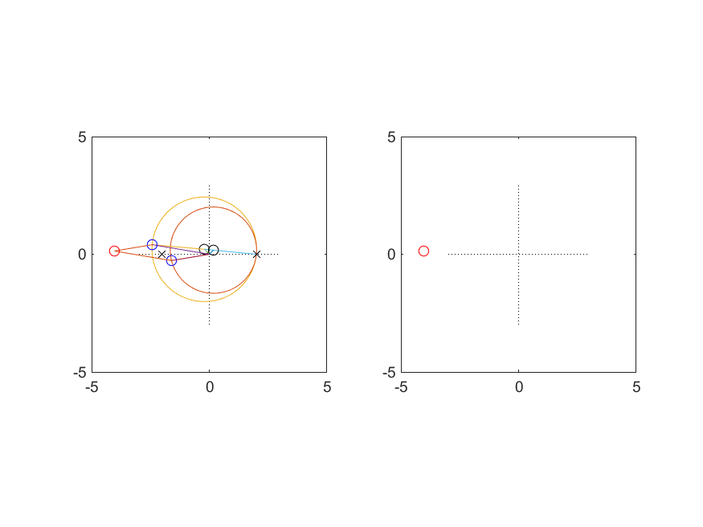

# Aerodynamics
This folder contains the four main projects I worked on while preparing for my Aerodynamics exam. Since the course was taught in Italian, comments on the code and variable names might be in Italian.

## Irrotational field solutions

In these MATLAB scripts you will find formulas to draw analytically the potential and current function level curves for the solutions of the following velocity fields:
- Undisturbed
- Single source
- Rankine solution (Velocity field and source)
- Source and sink
- Doublet
- Irrotational vortex
with a random point in the field and its curves.

For the potential around a cylinder, which can be constructed with a parallel field, a doublet pointing in the opposite direction and a vortex centered on the doublet, the curves were computed numerically with `contour`.

## Current function curves for a turbomachine
The case for a turbomachine was simplified by its syemmtry, and then solved with both Finite Differences Method and Finite Element Method implemented from scratch in MATLAB.

## Panels method
The 2D implementation of the panels method allows to compute the coefficient of pressure given the discretized geometry of the profile. The MATLAB script in the folder computes the NACA profile given its code and attempts to estimate said coefficient

 | 
|:--:|:--:
 Coefficient of pressure |  Discretization

## Žukovskij geometric transformation (Joukowski)
The script uses MATLAB plotting capabilities to show the construction of a wing profile with the known transform.

